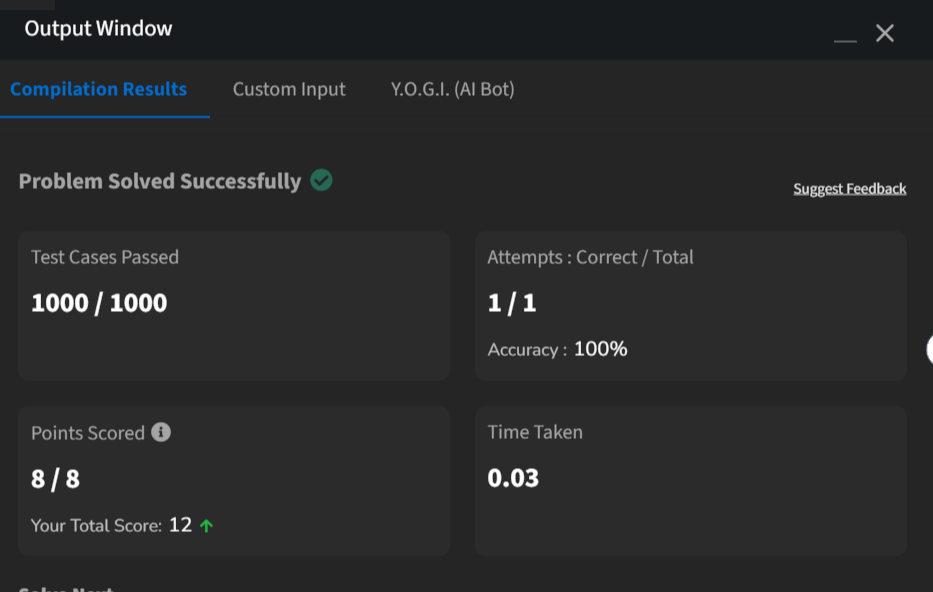

# Huffman Coding

**Paradigma:** Algoritmo Guloso

## Descrição

O problema consiste em gerar códigos binários de comprimento variável para cada caractere de uma string, de forma que os caracteres mais frequentes recebam os códigos mais curtos, minimizando o tamanho total da representação comprimida.

Cada caractere possui:

- um símbolo associado;
- uma frequência de ocorrência.

O objetivo é construir uma árvore de Huffman e retornar o código binário (Prefix Code) correspondente a cada caractere, garantindo que nenhum código seja prefixo de outro.

## Estratégia da Solução

Foi utilizada uma abordagem gulosa (Greedy Algorithm) combinada com uma min-heap (fila de prioridade).

Inicialmente, cada caractere é inserido na heap como um nó folha com sua respectiva frequência. A cada iteração, os dois nós de menor frequência são extraídos e combinados em um novo nó interno, cuja frequência é a soma dos dois. Esse processo é repetido até restar apenas a raiz da árvore.

Para garantir ordem consistente em casos de empate entre frequências iguais, cada nó armazena o menor índice original de sua subárvore, utilizado como critério de desempate.

Após a construção da árvore, os códigos são gerados percorrendo-a em pré-ordem: ao descer para o filho esquerdo acrescenta-se `0` ao código, e ao descer para o filho direito acrescenta-se `1`. O código acumulado é registrado ao atingir um nó folha.

## Complexidade

### Complexidade de Tempo

A complexidade do algoritmo é:

$$O(n \log n)$$

Onde `n` é o número de caracteres únicos. O custo principal está nas operações de inserção e extração da min-heap, realizadas a cada combinação de nós durante a construção da árvore.

### Complexidade de Espaço

A complexidade de espaço é:

$$O(n)$$

O algoritmo utiliza estruturas auxiliares para armazenar a heap e os nós da árvore, ambos proporcionais ao número de caracteres únicos.

## Problema Original

O problema utilizado neste trabalho foi obtido na plataforma GeeksForGeeks.

Link do problema: https://www.geeksforgeeks.org/problems/huffman-encoding3345/1

## Evidência de Execução

A imagem `accepted.png` apresenta a submissão aceita na plataforma online.

