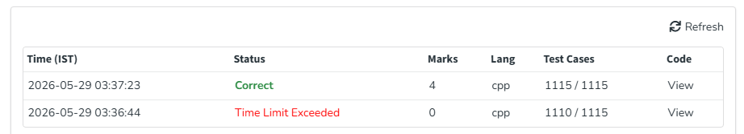

# Problema 3: Escalonamento de Tarefas (Job Sequencing Problem)

## Informações Gerais
* **Link para o problema original:** [GeeksforGeeks - Job Sequencing Problem](https://www.geeksforgeeks.org/problems/job-sequencing-problem-1587115621/1)
* **Técnica Algorítmica Utilizada:** Algoritmo Guloso (Greedy Algorithm) otimizado com Disjoint Set Union (DSU / Union-Find)

---

## Descrição do Problema
O problema consiste em selecionar e agendar uma sequência de tarefas unidimensionais de modo a maximizar o lucro total obtido. 

Cada tarefa possui um prazo limite (*deadline*), um valor de lucro associado e uma duração fixa de exatamente $1$ unidade de tempo. Sabendo que apenas uma única tarefa pode ser executada por vez e que ela só gera lucro se for concluída antes ou exatamente no seu tempo limite, o objetivo é encontrar a escala ideal que resulte no maior ganho financeiro possível e no número máximo de tarefas agendadas.

---

## Explicação da Solução
A estratégia adota uma abordagem **Gulosa** clássica: para maximizar o lucro, devemos dar prioridade absoluta às tarefas que pagam mais. No entanto, para evitar colisões de horários de forma eficiente, a solução utiliza a estrutura de dados **Disjoint Set Union (DSU)**:

1. **Ordenação:** Inicialmente, todas as tarefas são ordenadas em ordem decrescente com base no seu lucro. Caso haja empate, o critério guloso mantém a prioridade do maior ganho.
2. **Mapeamento do Tempo com DSU:** Criamos um conjunto disjunto onde cada elemento representa um *slot* de tempo disponível (de $0$ até o maior *deadline* encontrado). Inicialmente, cada slot aponta para si mesmo (`parent[i] = i`), indicando que está livre.
3. **Alocação Tardia (Estratégia Gulosa):** Para cada tarefa processada, tentamos alocá-la o mais tarde possível (no limite do seu *deadline*). Isso preserva os horários iniciais para tarefas que possuem prazos mais restritos. Usamos a operação `encontrar(limite)` para descobrir qual é o último slot de tempo disponível menor ou igual ao prazo da tarefa.
4. **Atualização dos Conjuntos:** Se o slot retornado for maior que $0$, a tarefa é agendada com sucesso. O lucro e o contador são incrementados. Em seguida, realizamos a união apontando esse slot para o slot imediatamente anterior (`disponivel - 1`). Assim, qualquer tarefa futura que busque este mesmo horário será redirecionada automaticamente para o próximo espaço vago à esquerda em tempo quase constante.

---

## Análise de Complexidade

### Complexidade de Tempo
* **Ordenação Inicial:** O custo para ordenar o vetor de tarefas com base no lucro é de $O(n \log n)$, onde $n$ é o número total de tarefas.
* **Processamento e Consultas DSU:** Para cada uma das $n$ tarefas, realizamos chamadas à função `encontrar`. Graças à otimização de **compressão de caminhos** (*path compression*) implementada na recursão do DSU, cada operação de busca e união roda em tempo amortizado de $O(\alpha(m))$, onde $\alpha$ é a função inversa de Ackermann (que cresce tão devagar que pode ser considerada constante, ou seja, $O(1)$ na prática).
* **Complexidade Total:** **$O(n \log n)$**. O gargalo do algoritmo reside unicamente na ordenação inicial. Essa otimização com DSU é significativamente mais eficiente do que a abordagem gulosa tradicional com vetores booleanos ordinários, que exigiria buscas lineares resultando em $O(n^2)$ e causaria *Time Limit Exceeded* (TLE).

### Complexidade de Espaço
* **Complexidade Total:** **$O(n + D)$**, onde $n$ é o número de tarefas armazenadas no vetor pareado e $D$ é o valor do maior *deadline* presente na entrada. Esse espaço é utilizado para alocar o vetor `parent` do DSU e as estruturas auxiliares de manipulação dos dados.

---

## Evidência de Execução Correta
A imagem abaixo comprova a submissão e aceitação do código na plataforma de juiz online:

