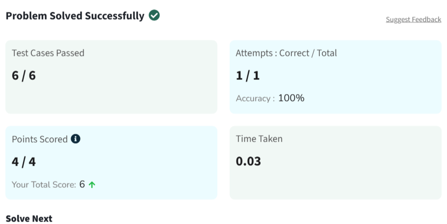

# The Knight's Tour Problem

## Paradigma

---

Backtracking

## Descrição

---

O problema consiste em encontrar um percurso válido para um cavalo em um tabuleiro de xadrez de dimensão `n × n`.

O cavalo inicia na posição `(0, 0)` e deve visitar todas as casas do tabuleiro exatamente uma única vez, seguindo as regras tradicionais de movimentação da peça no xadrez: duas casas em uma direção e uma casa na direção perpendicular.

O objetivo é retornar uma matriz onde cada posição contém o número da etapa em que a casa foi visitada. Caso não exista uma solução válida, deve-se retornar uma lista vazia.

## Estratégia da Solução

---

Foi utilizada a técnica de Backtracking para explorar todas as possíveis sequências de movimentos do cavalo.

A ideia principal consiste em posicionar o cavalo na casa inicial `(0, 0)` e, a partir dessa posição, tentar recursivamente todos os oito movimentos possíveis.

Para cada movimento:

- Verifica-se se a posição está dentro dos limites do tabuleiro;
- Verifica-se se a casa ainda não foi visitada;
- Marca-se a casa com o número correspondente ao passo atual;
- Continua-se a busca recursivamente a partir da nova posição.

Caso uma sequência de movimentos não leve a uma solução válida, o algoritmo desfaz a última jogada realizada e retorna para tentar outro caminho possível.

Esse processo continua até que todas as casas do tabuleiro sejam visitadas ou até que todas as possibilidades tenham sido exploradas.

## Complexidade

### Complexidade de Tempo

---

A complexidade do algoritmo é exponencial no pior caso:

```text
O(8^(n²))
```

Isso ocorre porque, para cada posição do cavalo, podem existir até oito movimentos possíveis, gerando uma grande árvore de busca recursiva.

Apesar disso, para os limites do problema (`1 ≤ n ≤ 6`), a solução é viável utilizando Backtracking.

### Complexidade de Espaço

---

A complexidade de espaço é:

```text
O(n²)
```

O espaço é utilizado para armazenar o tabuleiro contendo a ordem de visitação das casas.

---

## Evidência de Execução
A imagem `accepted.png` apresenta a submissão aceita na plataforma online.

---

**Link do problema:**
https://www.geeksforgeeks.org/dsa/the-knights-tour-problem/

O problema utilizado neste trabalho foi obtido na plataforma GeeksForGeeks.
## Problema Original

O(n²)

Além disso, existe o custo da pilha de chamadas recursivas, que pode atingir profundidade máxima de:
