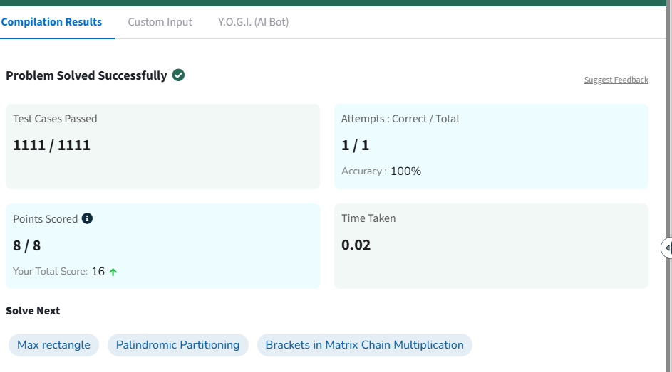

# Problema 2: Multiplicação de Cadeia de Matrizes (Matrix Chain Multiplication)

## Informações Gerais
* **Link para o problema original:** [GeeksforGeeks - Matrix Chain Multiplication](https://www.geeksforgeeks.org/problems/matrix-chain-multiplication0303/1)
* **Técnica Algorítmica Utilizada:** Programação Dinâmica (Dynamic Programming) com Memoização (*Top-Down*)

---

## Descrição do Problema
O problema consiste em determinar a ordem mais eficiente para realizar a multiplicação de uma sequência (cadeia) de matrizes. 

A multiplicação de matrizes é uma operação associativa, o que significa que o resultado final será o mesmo independentemente de como as matrizes são agrupadas por parênteses (ex: $(A(BC))$ ou $((AB)C)$). No entanto, a ordem em que as multiplicações são executadas altera drasticamente a quantidade de operações escalares necessárias. 

Dado um vetor que representa as dimensões das matrizes onde a matriz $A_i$ possui dimensões $arr[i-1] \times arr[i]$, o objetivo é encontrar a parentização que minimize o custo total de multiplicações.

---

## Explicação da Solução
Para evitar o cálculo redundante de subestruturas e encontrar a solução ótima, foi utilizada a técnica de **Programação Dinâmica**. A abordagem adota a estratégia *Top-Down* com memoização baseada nos seguintes passos:

1. **Definição dos Subproblemas:** Uma função recursiva `solve(i, j)` calcula o custo mínimo para multiplicar a cadeia de matrizes da posição $i$ até a posição $j$.
2. **Caso Base:** Se $i == j$, estamos lidando com uma única matriz. Nenhuma multiplicação é necessária, portanto o custo é $0$.
3. **Memoização:** Antes de realizar qualquer cálculo, o algoritmo verifica uma matriz bidimensional `dp[i][j]`. Se o valor for diferente de $-1$, significa que o custo mínimo para aquele intervalo já foi calculado previamente e o resultado é retornado imediatamente.
4. **Transição e Escolha Ótima:** Se o resultado não estiver na tabela, o algoritmo testa todas as posições possíveis de divisão $k$ (onde $i \le k < j$). Para cada $k$, o custo é calculado somando o impacto das duas subcadeias geradas mais o custo de multiplicar as duas matrizes resultantes:
   $$\text{custo} = \text{solve}(i, k) + \text{solve}(k + 1, j) + (arr[i - 1] \times arr[k] \times arr[j])$$
   O menor valor encontrado entre todas as divisões possíveis de $k$ é armazenado em `dp[i][j]` e retornado.

---

## Análise de Complexidade

### Complexidade de Tempo
* **Complexidade Total:** **$O(n^3)$**. Existem $O(n^2)$ estados possíveis na tabela DP (combinações de $i$ e $j$). Para cada estado, o algoritmo executa um laço `for` que varia de $i$ até $j$, realizando até $n$ iterações para encontrar o ponto de divisão ótimo $k$. Portanto, o tempo total é proporcional a $n^2 \times n = O(n^3)$.
* **Comparação:** Embora o custo cúbico pareça alto, a abordagem puramente recursiva sem Programação Dinâmica resultaria em uma complexidade exponencial de **$O(2^n)$**, tornando-a inviável mesmo para pequenas quantidades de matrizes.

### Complexidade de Espaço
* **Complexidade Total:** **$O(n^2)$**. Este espaço é ocupado pela matriz de memoização `dp` de tamanho $n \times n$ utilizada para armazenar os resultados intermediários, além do espaço da pilha de recursão que consome no máximo $O(n)$ chamadas simultâneas.

---

## Evidência de Execução Correta
A imagem abaixo comprova a submissão e aceitação do código na plataforma de juiz online:

