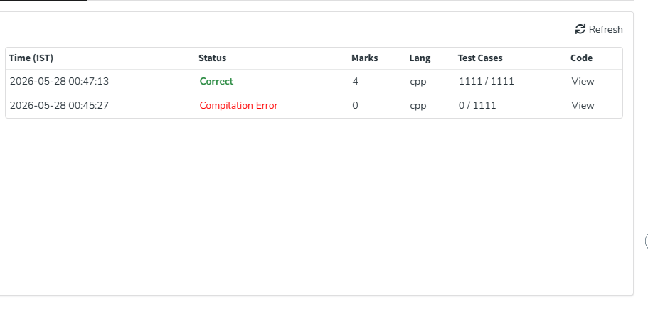

# Problema 4: Rato em um Labirinto (Rat in a Maze)

## Informações Gerais
* **Link para o problema original:** [GeeksforGeeks - Rat in a Maze Problem - I](https://www.geeksforgeeks.org/problems/rat-in-a-maze-problem/1)
* **Técnica Algorítmica Utilizada:** Backtracking (Busca com Retrocesso)

---

## Descrição do Problema
O problema consiste em encontrar todos os caminhos válidos possíveis para um rato caminhar de uma posição inicial até uma posição final dentro de uma matriz quadrada (labirinto) de tamanho $N \times N$. 

A célula inicial está localizada no canto superior esquerdo $(0, 0)$ e a célula de destino está no canto inferior direito $(N-1, N-1)$. A matriz possui blocos livres (representados pelo valor $1$) e blocos bloqueados (representados pelo valor $0$). O rato pode se mover nas direções Baixo (Down - 'D'), Esquerda (Left - 'L'), Direita (Right - 'R') e Cima (Up - 'U'). O objetivo é gerar uma lista com as strings de direções de todos os caminhos que levam ao destino sem passar por uma mesma célula mais de uma vez.

---

## Explicação da Solução
Para explorar o espaço de estados do labirinto e encontrar todas as combinações viáveis, foi utilizada a técnica de **Backtracking** (busca exaustiva baseada em profundidade):

1. **Condição de Parada Inicial:** O algoritmo verifica se a célula de partida $(0, 0)$ está bloqueada ($0$). Se estiver, o labirinto é considerado intransitável de imediato.
2. **Exploração Recursiva:** A partir de uma posição atual $(x, y)$, a função testa de forma sequencial e ordenada as quatro direções válidas através de vetores de deslocamento (`dx` e `dy`), seguindo a ordem lexicográfica recomendada pelo problema ("D", "L", "R", "U").
3. **Validação de Movimento:** Antes de efetuar um passo, o algoritmo confere se as novas coordenadas estão dentro dos limites da matriz, se a célula está livre ($1$) e se ela ainda não foi explorada na ramificação atual.
4. **Estado e Retrocesso (Backtracking):** Ao avançar para uma nova posição, ela é marcada como visitada (`visitado[novoX][novoY] = 1`) para evitar loops infinitos. A recursão continua avançando até atingir o destino $(N-1, N-1)$. Ao retornar da chamada recursiva, a célula é desmarcada (`visitado[novoX][novoY] = 0`), limpando o rastro para que outros caminhos alternativos possam utilizar essa mesma coordenada.

---

## Análise de Complexidade

### Complexidade de Tempo
* **Complexidade Total:** **$O(3^{N^2})$**. Em uma análise teórica ampla de pior caso, como a matriz possui $N^2$ células e de cada ponto podemos ramificar para até 4 direções, a complexidade máxima seria limitada por $O(4^{N^2})$. No entanto, como o caminho não pode cruzar a si mesmo e o ponto de onde o rato acabou de vir está bloqueado pela marcação de visita, o número real de decisões válidas por célula é de no máximo 3 direções. 
* **Crescimento:** Por se tratar de um algoritmo de força bruta inteligente (exaustivo), o comportamento do tempo é exponencial. O Backtracking testa sistematicamente caminhos promissores e retrocede assim que atinge um beco sem saída, reduzindo o tempo prático em matrizes esparsas.

### Complexidade de Espaço
* **Complexidade Total:** **$O(N^2)$**. Este espaço de memória é determinado pela matriz auxiliar `visitado` de tamanho $N \times N$ usada para o controle de caminhos fechados, somada à profundidade máxima que a pilha de chamadas recursivas do sistema pode atingir, que no pior cenário de um caminho em caracol é também proporcional ao número total de células, ou seja, $O(N^2)$.

---

## Evidência de Execução Correta
A imagem abaixo comprova a submissão e aceitação do código na plataforma de juiz online:

